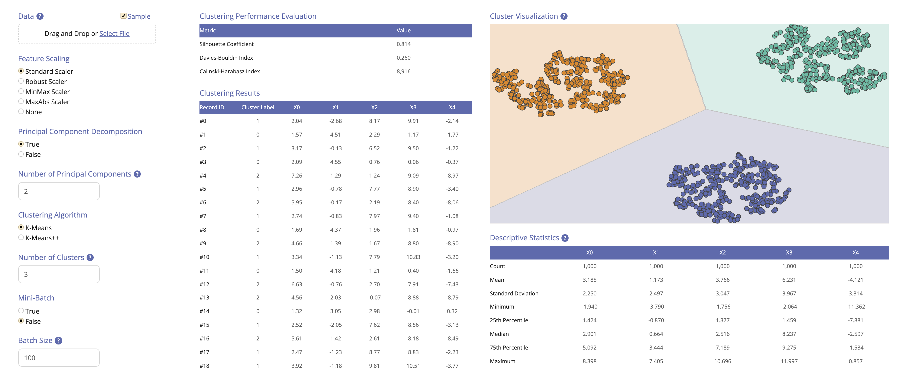

## Plotly Dash Clustering App

This app performs k-means clustering using `scikit-learn`. The user can upload the data in CSV, TXT, XLS or XLSX format. 
The input file should contain the index in the first column and the features in the subsequent columns, with the
corresponding column headers. Any missing values are automatically removed by the app.

<br>



The app allows the user to scale the data as well as to decompose the data using Principal Component Analysis (PCA)
prior to applying the clustering algorithm. The app includes a table with a number of clustering performance metrics,
a table with the cluster labels of the raw data, a table with the descriptive statistics of the raw data, and a cluster
visualization obtained by reducing the results to two dimensions using t-SNE.

This app was built with Plotly and Dash. For more details, see the [documentation](https://plotly.com/).

### Dependencies
```bash
pandas==1.2.2
numpy==1.19.5
scikit-learn==1.0.1
plotly==5.3.0
dash==1.21.0
dash_html_components==1.1.4
dash_core_components==1.17.1
dash_bootstrap_components==0.13.0
dash_renderer==1.9.1
flask==2.0.2
```
### Usage
1. Clone the repository.

    ```bash
    git clone https://github.com/flaviagiammarino/dash-clustering
    cd /dash-clustering/application
    ```

2. Install the requirements.

    ```bash
    pip install -r requirements.txt
    ```

3. Run the app.

    ```bash
    python application.py
    ```
